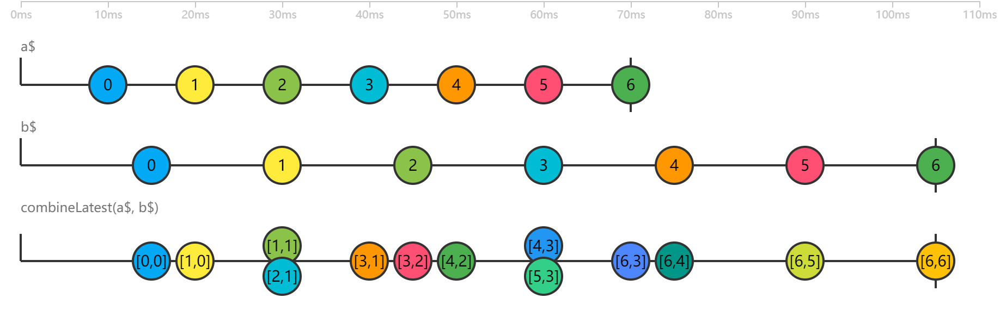

# 合并数据流

rxjs 提供了众多合并数据流的操作符。

| 操作符                                      | 作用                                     |
| ------------------------------------------- | ---------------------------------------- |
| concat、concatAll                           | 首尾相连合并                             |
| merge、mergeAll                             | 先到先得合并                             |
| zip、zipAll                                 | 一一对应合并                             |
| combineLatest、combineAll 和 withLatestFrom | 合并最新产生的数据                       |
| race                                        | 从多个数据流中选取第一个产生内容的数据流 |
| startWith                                   | 在数据流开始前添加数据                   |
| forkJoin                                    | 获取多个数据流最后产生的那个数据         |
| switch 和 exhaust                           | 从高阶数据流中切换数据源                 |

## 合并类操作符

合并类操作符都有两种形式，既提供静态操作符，又提供实例操作符。当我们合并两个数据流，假设分别称为 source1$ 和 source2$，也就可以说 source2$ 汇入了 source1$，这时候用一个 source1$ 的实例操作符语义上比较合适；在某些场景下，两者没有什么主次关系，只是两个平等关系的数据流合并在一起，这时候用一个静态操作符更加合适。

### concat

```js
export function useConcat() {
    const source1$ = Observable.of(1, 2, 3)
    const source2$ = Observable.of(4, 5, 6)
    const concated$ = source1$.concat(source2$)
    concated$.subscribe(console.log)
}
```

concat 有两个输入，分别称为 source1$和source2$。source1$产生的所有数据全都被concat直接转给了下游，当source1$完结的时候，concat 会调用 source1$.unsubscribe，然后调用source2$.subscribe，继续从 source2$中抽取数据传给下游。

concat 开始从下一个 Observable 对象抽取数据只能在前一个 Observable 对象完结之后，所以参与到这个 concat 之中的 Observable 对象应该都能完结，如果一个 Observable 对象不会完结，那排在后面的 Observable 对象永远没有上场的机会。

```js
export function useConcat() {
    const source1$ = Observable.interval(1000)
    // const source1$ = Observable.of(1, 2, 3)
    const source2$ = Observable.of(4, 5, 6)
    const concated$ = source1$.concat(source2$)
    concated$.subscribe(console.log)
}
```

source2$ 永远不会被打印出来，因为 source1$ 永远不会完结。

### merge -- 先到先得快速通过

merge 与 concat 不同，merge 会第一时间订阅所有的上游 Observable，然后对上游的数据采取“先到先得”的策略，任何一个 Observable 只要有数据推下来，就立刻转给下游 Observable 对象。

1. 数据汇流

```js
export function useMerge() {
    // 0A 1A 2A 3A  ...
    //   0B 1B 2B 3B  ...
    // 0A 0B 1A 1B 2A 2B 3A 3B...
    const source1$ = Observable.timer(0, 5000).map(x => x + 'A')
    const source2$ = Observable.timer(1000, 5000).map(x => x + 'B')
    const merged$ = source1$.merge(source2$)
    merged$.subscribe(console.log)
}
```

source1$ 从第 0 秒开始，每隔 5 秒产生一个数据，0A、1A、2A、3A...，source2$ 从第 1 秒开始，每隔 5 秒产生一个数据，0B、1B、2B、3B...。merged$ 会在第 0 秒产生 0A，第 1 秒产生 0B，第 5 秒产生 1A，第 6 秒产生 1B，以此类推。

通过 merge 组合之后，下游的数据就是 source1$ 和 source2$ 的数据交叉出现。

merge 只有在所有的上游 Observable 都完结的时候，才会完结自己产生的 Observable 对象，在上面的例子中，source1$和source2$都不会完结，所以由 merge 组合产生的新数据流也不会完结。

一般来说，merge 只对产生异步数据的 Observable 才有意义，用 merge 来合并同步产生数据的 Observable 对象没什么意义。

```js
export function useMerge() {
    const source1$ = Observable.of(1, 2, 3)
    const source2$ = Observable.of('11', '22', '33')
    const merged$ = source1$.merge(source2$)
    merged$.subscribe(console.log)
}
```

输出：1 2 3 11 22 33

merge 做的事情很简单：**依次订阅上游 Observable 对象，把接收到的数据转给下游，等待所有上游对象 Observable 完结**。因为 of 产生的是同步数据流，当 merge 订阅 source1$ 之后，还没来得及去订阅 source2$，source1$就一口气把自己的数据全吐出来了，所以实际上产生了 concat 的效果。
所以，应该避免用 merge 去合并同步数据流，merge 应该用于合并产生异步数据的 Observable 对象，一个常用场景就是合并 DOM 事件。

2. 同步限流

merge 可以有一个可选参数 concurrent，用于指定可以同时合并的 Observable 对象个数。

```js
export function useMerge() {
    const source1$ = Observable.timer(0, 5000).map(x => x + 'A')
    const source2$ = Observable.timer(1000, 5000).map(x => x + 'B')
    const merged$ = source1$.merge(source2$, 1)
    merged$.subscribe(console.log)
}
```

source2$ 中的数据不会进入 merged$，因为 source1$ 和 source2$ 同时只能有 1 个 Observable 对象在合并，也就是 source1$。

3. 应用场景

fromEvent 可以从网页中获取事件，只可惜，fromEvent 一次只能从一个 DOM 元素获取一种类型的事件。比如，我们关心某个元素的 click 事件，同时也关心这个元素上的 touchend 事件，因为在移动设备上 touchend 事件出现得比 click 更早，这两个事件的处理是一模一样的，但是 fromEvent 不能同时获得两个事件的数据流，这时候就要借助 merge。

```js
export function useMerge() {
    const click$ = Observable.fromEvent(document, 'click')
    const touchend$ = Observable.fromEvent(document, 'touchend')
    Observable.merge(click$, touchend$).subscribe(e => console.log(e.type))
}
```

> PC 端只输出 click，移动端输出 touchend click。

### zip -- 一一对应合并

zip 含义是拉链，只有两条拉链的链齿一一对应，才能拉上拉链。zip 操作符的作用就是把两个数据流一一对应合并在一起，只有当两个数据流都产生了数据，才会产生新的数据。

1. 一对一合并

```js
export function useZip() {
    const source1$ = Observable.of(1, 2, 3)
    const source2$ = Observable.of('a', 'b', 'c')
    const zipped$ = source1$.zip(source2$)
    zipped$.subscribe(console.log)
}
```

输出： `[1, 'a'] [2, 'b'] [3, 'c']`

zip 会把上游的数据转化为数组形式，每一个上游 Observable 贡献的数据会在对应数组中占一席之地。

zip 执行的时候，它会立刻订阅所有的上游 Observable，然后开始合并数据，在上面的例子中，source1$产生的数据序列会和source2$产生的数据序列配对，1 配上 a，2 配上 b，3 配上 c，所以产生 3 个数组传递给下游。

异步数据，表现如何呢？

```js
export function useZip() {
    const source1$ = Observable.interval(1000)
    const source2$ = Observable.of('a', 'b', 'c')
    source1$.subscribe(console.log)
    const zipped$ = source1$.zip(source2$)
    zipped$.subscribe(console.log)
}
```

source1$每隔1秒钟吐出一个从0开始的递增整数序列，source2$则是同步产生三个字符串，最后程序的运行结果如下，但是前三行的输出都有 1 秒钟的间隔。

```bash
# 第1秒
1
[1,'a']
# 第2秒
2
[2,'b']
# 第3秒
3
[3,'c']
# 第4秒
4
# 第5秒
5
...
```

出现时间间隔，是因为 zip 要像拉链一样做到一对一咬合。虽然 source2$第一时间就吐出了字符串a，但是source1$并没有吐出任何数据，所以字符串 a 只能等着，直到 1 秒钟的时候，source1$吐出了0时zip就把两个数据合并为一个数据传给下游。这时候source2$的第二个数据字符串 b 已经跃跃欲试，但是还是不该它上场，因为 source1$并不会立刻吐出数据，又要等待 1 秒钟，才有数据 1 吐出来，这时候字符串才能找到配对的对象。如此这般，字符串 c 也要再等 1 秒钟才能被配对。

source1$是由interval产生的数据流，是不会完结的，但是zip产生的Observable对象却在source2$吐完所有数据之后也调用了 complete，也就是说，**只要任何一个上游的 Observable 完结。zip 只要给这个完结的 Observable 对象吐出的所有数据找到配对的数据，那么 zip 就会给下游一个 complete 信号**。

所以看到 3 秒后，不再输出数组，是因为 source2$ 已经吐完了所有数据，zip 也就完结了，但是 source1$ 会一直运行下去，继续输出 4 5 6 ... 。

2. 数据累积问题

如果某个上游 source1$吐出数据的速度很快，而另一个上游source2$吐出数据的速度很慢，那 zip 就不得不先存储 source1$吐出的数据，因为RxJS的工作方式是“推”，Observable把数据推给下游之后自己就没有责任保存数据了。被source1$推送了数据之后，zip 就有责任保存这些数据，等着和 source2$未来吐出的数据配对。假如source2$迟迟不吐出数据，那么 zip 就会一直保存 source1$没有配对的数据，然而这时候source1$可能会持续地产生数据，最后 zip 积压的数据就会越来越多，占用的内存也就越来越多。
对于数据量比较小的 Observable 对象，这样的数据积压还可以忍受，但是对于超大量的数据流，使用 zip 就不得不考虑潜在的内存压力问题，zip 这个操作符自身是解决不了这个问题的，在后续的章节中我们会介绍如何处理这种情况。

3. 合并多个数据流

zip 组合超过两个 Observable 对象，游戏规则依然一样，组合而成的 Observable 吐出的每个数据依然是数组，数组元素个数和上游 Observable 对象数量相同，每个上游 Observable 对象都要贡献一个元素，如果某个 Observable 对象没有及时吐出数据，那么 zip 会等，等到它吐出匹配的数据，或者等到它完结。

吐出数据最少的上游 Observable 决定了 zip 产生的数据个数。例如有三个上游分别为 source1$、source2$、source3$，source1$吐出 3 个数据后完结，source2$吐出4个数据后完结，source3$永不完结，那么通过 zip 合并三者产生的 Observable 对象也就只产生 3 个数据。假如 source2$在时间上要比source1$早完结，这种情况下 zip 会等待 source1$吐出数据，但是最终source1$没有产生数据而是完结，那么只不过 zip 白等了而已，最后就丢弃 source2$产生的最后一个数据。

### combineLatest -- 合并最新产生的数据

combineLatest 合并数据流的方式是当任何一个上游 Observable 产生数据时，从所有输入 Observable 对象中拿最后一次产生的数据（最新数据），然后把这些数据组合起来传给下游。可能会重复使用最新的数据。



```js
export function useCombineLatest() {
  //    0    1    2    3 ...
  const source1$ = Observable.interval(4000)
  //     0     1     2     3 ...
  const source2$ = Observable.interval(5000)
  const combineLatest$ = source1$.combineLatest(source2$)
  //第5秒 [0,0] 第9秒[1,0] 第10秒[1,1] 第14秒[2,1] 第15秒[2,2] 第16秒 [3,2] ...
  combineLatest$.subscribe(console.log)
}
```
弹珠图：

```bash
# source1$ 
#    0    1    2    3    4  ...
# source2$
#     0     1     2     3     4 ...
# combineLatest$
#     00  1011 21 22 32 3343  44 ...
```

combineLatest产生的Observable对象会生成数组数据。每个数组中元素的个数和上游Observable数量相同，每个元素的下标和对应数据源在combineLatest中的参数位置一致。

只有当所有上游Observable对象都完结之后，combineLatest才会给下游一个complete信号，表示不会有任何数据更新了。

